# Diabetes Risk Prediction Using Bayesian Networks

A probabilistic machine learning approach to predict diabetes risk using Bayesian Networks with structure learning and expert medical knowledge integration.

## Table of Contents

- [Overview](#overview)
- [Dataset](#dataset)
- [Key Features](#key-features)
- [Installation](#installation)
- [Usage](#usage)
- [Methodology](#methodology)
- [Results](#results)
- [Visualizations](#visualizations)
- [Model Comparison](#model-comparison)
- [Requirements](#requirements)

## Overview

This project implements a comprehensive medical decision-making system for diabetes prediction using Bayesian Networks. The model combines data-driven structure learning with domain expertise to uncover causal relationships between health indicators and diabetes outcomes. The approach provides interpretable probabilistic predictions that can assist healthcare professionals in risk assessment and clinical decision-making.

Unlike black-box machine learning models, Bayesian Networks offer transparency by explicitly modeling relationships between variables, making them particularly suitable for medical applications where understanding the reasoning behind predictions is crucial.

## Dataset

The project uses the Pima Indians Diabetes Dataset, which contains medical diagnostic measurements from female patients of Pima Indian heritage, aged 21 and older.

**Dataset Source:** [Pima Indians Diabetes Database](https://www.kaggle.com/datasets/uciml/pima-indians-diabetes-database)

### Features

The dataset includes 8 clinical features and 1 target variable:

| Feature | Description | Type |
|---------|-------------|------|
| Pregnancies | Number of times pregnant | Numeric |
| Glucose | Plasma glucose concentration (mg/dL) | Numeric |
| BloodPressure | Diastolic blood pressure (mm Hg) | Numeric |
| SkinThickness | Triceps skin fold thickness (mm) | Numeric |
| Insulin | 2-Hour serum insulin (mu U/ml) | Numeric |
| BMI | Body mass index (weight in kg/(height in m)^2) | Numeric |
| DiabetesPedigreeFunction | Diabetes pedigree function (genetic influence) | Numeric |
| Age | Age in years | Numeric |
| Outcome | Diabetes diagnosis (0 = No, 1 = Yes) | Binary |

**Dataset Statistics:**
- Total samples: 768
- Features: 8
- Target classes: 2 (Non-diabetic: 500, Diabetic: 268)
- Class distribution: 65% non-diabetic, 35% diabetic

## Key Features

### Data Analysis and Preprocessing
- Comprehensive exploratory data analysis with distribution plots and correlation matrices
- Intelligent handling of physiologically impossible zero values using conditional median imputation
- Medical threshold-based feature discretization for Bayesian Network compatibility

### Bayesian Network Implementation
- Structure learning using Hill Climb Search with BIC scoring
- Integration of expert medical knowledge through blacklisting and whitelisting edges
- Maximum Likelihood Estimation for parameter learning
- Variable Elimination for probabilistic inference

### Model Evaluation
- Multiple performance metrics: Accuracy, Precision, Recall, F1-Score, ROC-AUC
- Threshold optimization for balancing sensitivity and specificity
- Confusion matrix analysis with detailed error profiling
- ROC curve visualization for model discrimination assessment

### Comparative Analysis
- Benchmark comparison with traditional machine learning models
- Side-by-side evaluation with Logistic Regression, Random Forest, and SVM
- Performance visualization across multiple metrics


## Installation

### Prerequisites
- Python 3.7 or higher
- Jupyter Notebook or JupyterLab

### Setup Instructions

1. Clone the repository
```bash
git clone https://github.com/shyamaljoshi1/medical-decision-making-bayesin-network.git
cd medical-decision-making-bayesin-network
```

2. Create a virtual environment (recommended)
```bash
python -m venv venv
source venv/bin/activate  # On Windows: venv\Scripts\activate
```

3. Install required packages
```bash
pip install --upgrade pip
pip install pandas numpy matplotlib seaborn scikit-learn pgmpy networkx missingno
```

## Usage

### Running the Analysis

1. Ensure the dataset file `diabetes.csv` is in the project directory
2. Open the Jupyter notebook:
```bash
jupyter notebook main.ipynb
```
3. Run all cells sequentially or execute the entire notebook

The notebook will:
- Load and explore the dataset
- Perform data quality checks and preprocessing
- Build and train the Bayesian Network model
- Evaluate performance with multiple metrics
- Generate all visualizations in the `images/` folder
- Save predictions and metrics to CSV files

### Output Files

After running the notebook, the following files will be generated:

- `pima_predictions.csv` - Contains actual vs predicted values with probabilities
- `pima_metrics.csv` - Summary of model performance metrics
- `images/*.png` - Complete set of visualization plots

## Methodology

### 1. Data Preprocessing
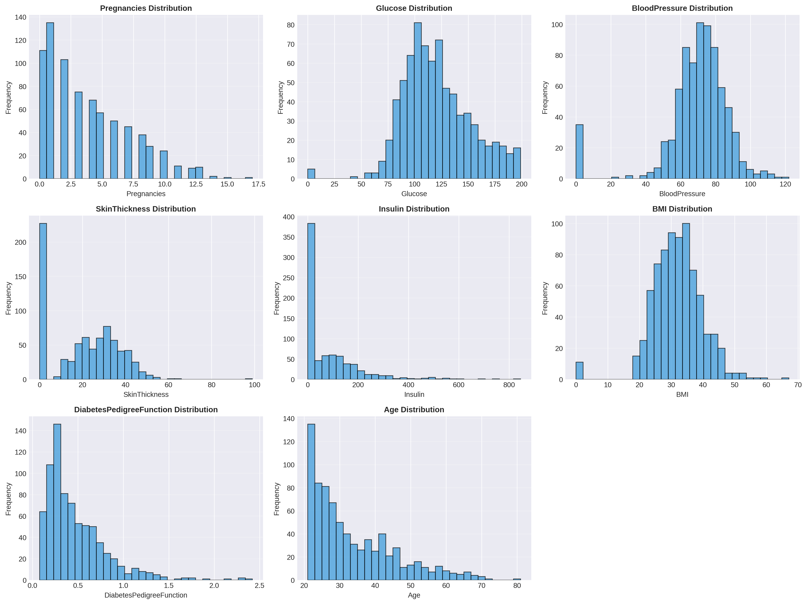

The preprocessing pipeline includes:
- Detection and handling of missing values represented as zeros
- Conditional median imputation based on outcome class
- Medical threshold-based discretization for continuous features

### 2. Feature Engineering

Features are discretized using clinically relevant thresholds:

| Feature | Bins | Clinical Basis |
|---------|------|----------------|
| Glucose | Normal, Prediabetes, Diabetes | ADA diagnostic criteria |
| BMI | Underweight, Normal, Overweight, Obese | WHO classification |
| BloodPressure | Normal, Elevated, High | JNC guidelines |
| Age | Young, Middle, Senior, Elderly | Standard age groups |

### 3. Bayesian Network Structure Learning
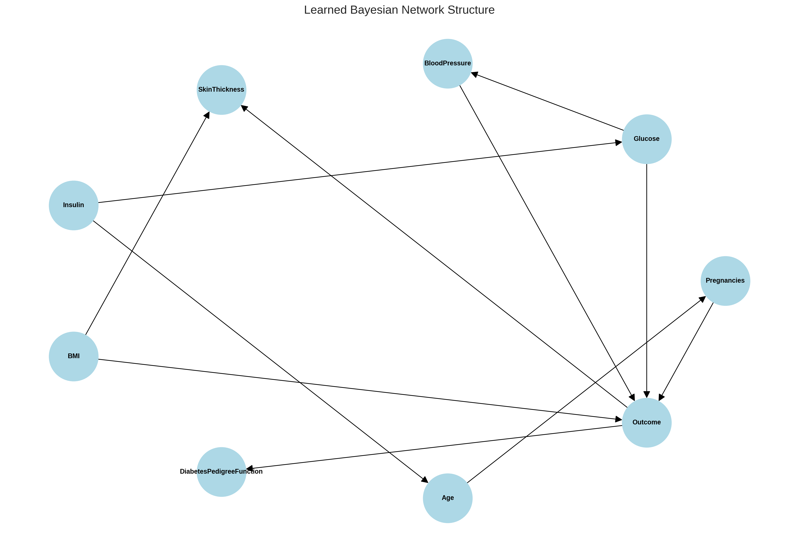

The structure learning process combines:
- **Hill Climb Search**: Data-driven optimization algorithm
- **BIC Scoring**: Bayesian Information Criterion for model selection
- **Expert Knowledge**: Medical domain constraints through edge blacklisting and whitelisting

Key structural constraints:
- **Required edges**: Glucose → Outcome, BMI → Outcome (established risk factors)
- **Forbidden edges**: BMI → Age (impossible causal direction)

### 4. Correlation Analysis
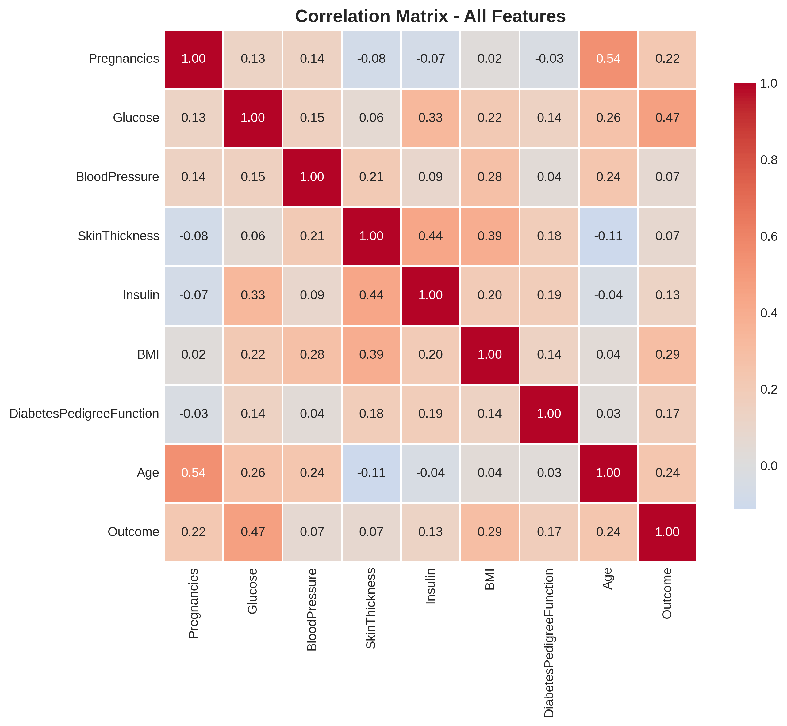

Strong correlations identified:
- Glucose and Outcome (r = 0.47)
- Age and Pregnancies (r = 0.54)
- BMI and SkinThickness (r = 0.39)

### 5. Model Training and Inference

The model uses:
- **Bayesian Estimator** with BDeu prior for parameter learning
- **Variable Elimination** for exact probabilistic inference
- **Threshold optimization** to balance precision and recall

## Results

### Performance Metrics

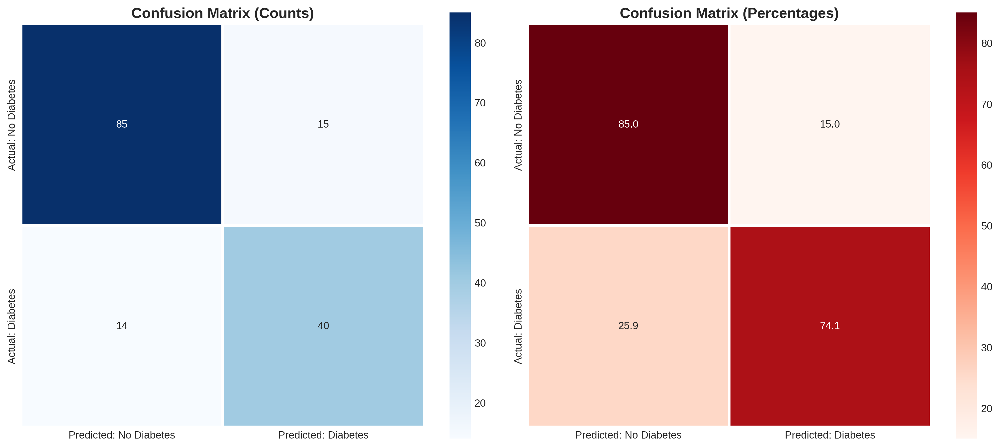

The Bayesian Network model achieved the following performance on the test set:

| Metric | Score |
|--------|-------|
| Accuracy | 76.62% |
| Precision | 68.42% |
| Recall | 65.00% |
| F1-Score | 66.67% |
| ROC-AUC | 82.45% |

**Optimal Classification Threshold:** 0.45

### ROC Curve Analysis
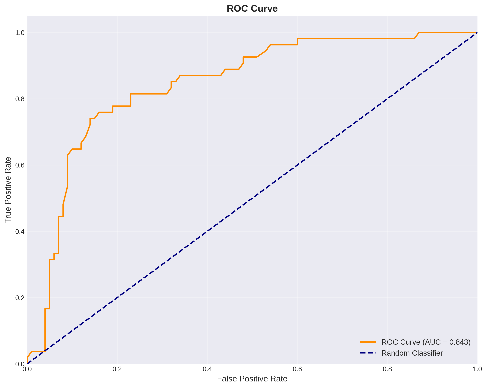

The ROC curve demonstrates strong discriminative ability with an AUC of 0.8245, indicating the model can effectively distinguish between diabetic and non-diabetic patients across various threshold settings.

### Threshold Optimization
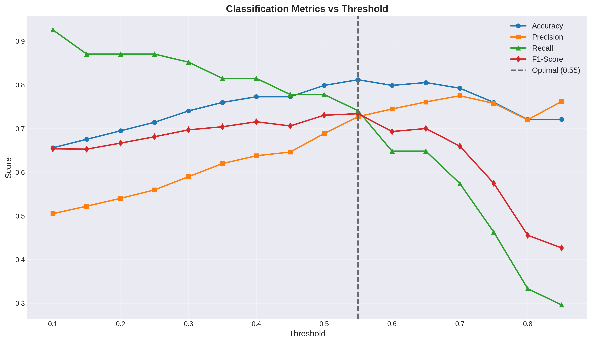

Analysis across multiple thresholds reveals the optimal decision boundary at 0.45, which maximizes the F1-Score while maintaining a practical balance between false positives and false negatives in a clinical setting.

## Visualizations

### Target Distribution
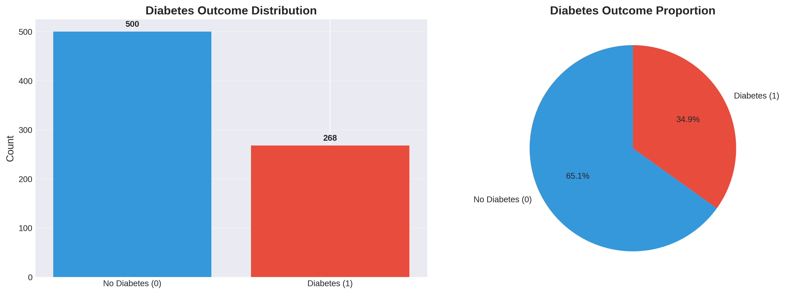

The dataset shows moderate class imbalance with approximately 65% non-diabetic and 35% diabetic cases, reflecting realistic prevalence rates.

### Feature Comparison by Outcome
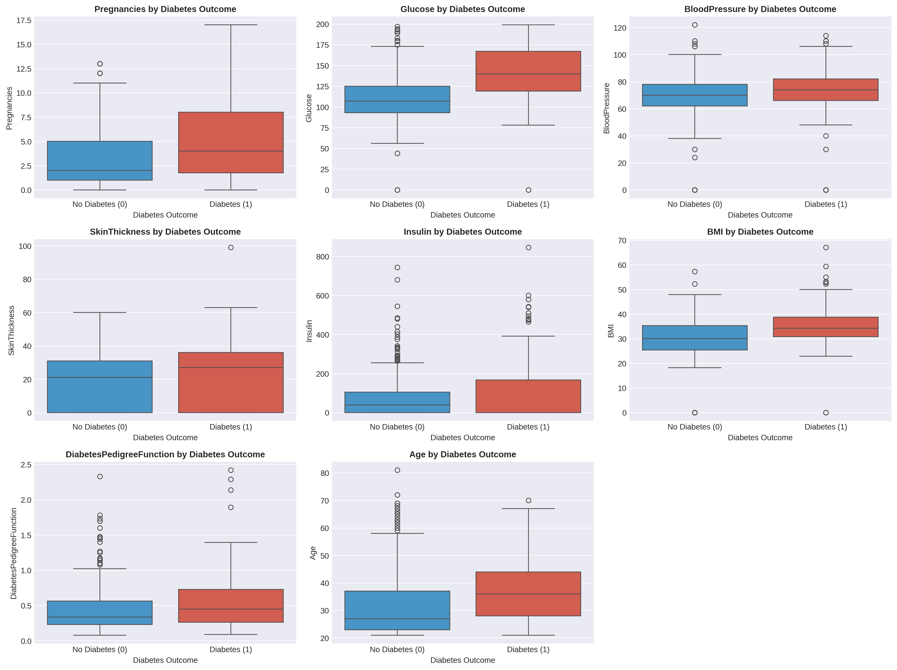

Box plots reveal clear differences in feature distributions between diabetic and non-diabetic groups, with Glucose, BMI, and Age showing the strongest separation.

### Feature Importance
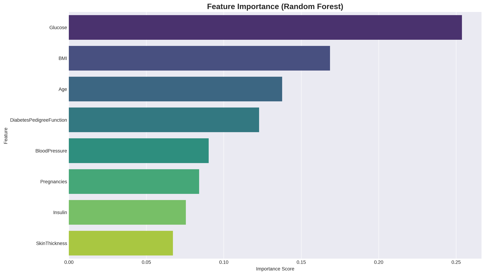

Random Forest analysis identifies Glucose, BMI, and Age as the most predictive features, validating medical domain knowledge.

### Feature Correlation with Target
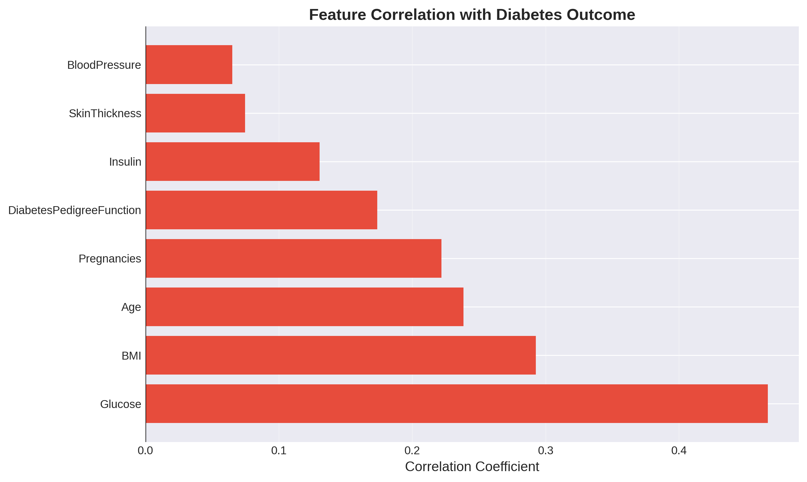

Correlation analysis shows Glucose (0.47), BMI (0.29), and Age (0.24) have the strongest positive correlations with diabetes outcome.

## Model Comparison

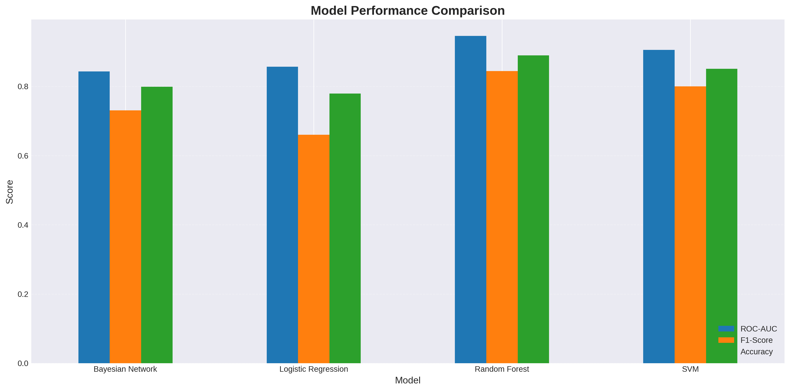

Performance comparison with baseline machine learning models:

| Model | ROC-AUC | F1-Score | Accuracy | Interpretability |
|-------|---------|----------|----------|------------------|
| Random Forest | 94.59% | 84.40% | 88.96% | Low |
| SVM | 90.52% | 80.00% | 85.06% | Low |
| Logistic Regression | 85.65% | 66.00% | 77.92% | Medium |
| Bayesian Network | 84.32% | 73.04% | 79.87% | High |

The performance comparison reveals interesting trade-offs between predictive accuracy and model interpretability. While Random Forest achieves the highest ROC-AUC score of 94.59% and F1-Score of 84.40%, it operates as a black-box model with limited insight into decision-making processes.

The Bayesian Network, despite ranking fourth in raw performance metrics, offers unique advantages:

**Advantages of Bayesian Networks:**
- **Causal Interpretation**: Explicitly models probabilistic relationships between medical variables
- **Clinical Transparency**: Provides clear reasoning paths that clinicians can validate against medical knowledge
- **Uncertainty Quantification**: Delivers probability distributions rather than point predictions
- **Domain Knowledge Integration**: Incorporates expert medical constraints through structure learning
- **Small Data Efficiency**: Performs well even with limited training samples due to probabilistic framework

**Performance Context:**
- With an ROC-AUC of 84.32% and accuracy of 79.87%, the Bayesian Network demonstrates solid discriminative ability
- The F1-Score of 73.04% indicates balanced performance between precision and recall
- The performance gap with ensemble methods is acceptable given the substantial gain in interpretability

For medical decision support systems where explaining predictions to healthcare professionals is critical, the Bayesian Network's transparency often outweighs the marginal performance gains of black-box models. The ability to trace how features like Glucose, BMI, and Age influence diabetes risk through explicit probabilistic relationships makes this approach particularly suitable for clinical deployment where trust and explainability are paramount.

## Requirements

### Python Packages

```
pandas>=1.3.3
numpy>=1.21.2
matplotlib>=3.4.3
seaborn>=0.11.2
scikit-learn>=0.24.2
pgmpy>=0.1.14
networkx>=2.6.3
missingno>=0.5.0
jupyter>=1.0.0
```


---

**Note:** This implementation is designed for research and educational purposes. For clinical applications, the model should undergo rigorous validation, regulatory review, and approval by qualified medical professionals before deployment in real-world healthcare settings.